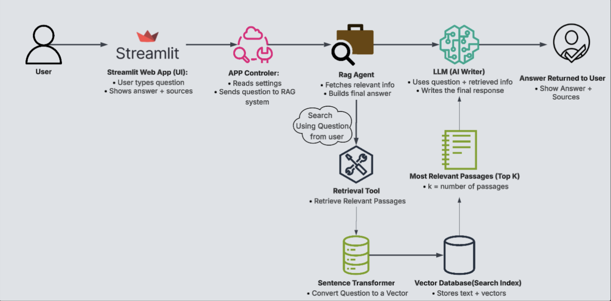

# World War 1 Rag Agent

A retrieval-augmented research assistant that answers **World War I** questions using a document collection
The app is built with a **RAG pipeline** so answers are based in articles and media from duck.db database.

---
## Domain Overview & Problem Statement

### Domain
World War I which is an extremely important confilict in world history:
- It has dense historical context (alliances, diplomacy, military doctrine, social factors, economic factors),
- conflicting interpretations (war guilt, inevitability, responsibility),
- frequent student-facing needs (timelines, key actors, primary-source grounding, templates, introductions).

### Problem Statement
Students and researchers often get surface level summaries without evidence or sources. Students do not even know if the information that was given to them is really accurate. Additionally I feels there is a massive gap in the amount of modern information and tools regarding World War 1 compared to World War 2. Lastly, I felt that the interest in the First World War has really faded in the present day.

**Usefullness of Agent**

I managed to solve this problems above becuase I created an agent that generates relevant answers retrieving relevant passages from a well reaserched library of documents. The answers it generates come with citations that users can use to check the information or expand on the question by looking into the source. Lastly, it provides a modern way to explore World War 1 that can incentivize the interest in this important topic.

---

## Pipeline
1. User question enters the Streamlit UI  
2. Pipeline retrieves relevant chunks from the WWI corpus  
3. An agent synthesizes a response grounded in retrieved text  
4. UI shows the final answer + citations + sources

## Document Collection:

**Primary Sources**
- Blank Check Ultimatum
- Official government statements, ultimatums, and treaties
- Speeches and memoirs from political and military leaders
- Contemporary newspaper articles
  
Primary sources allow the agent to quote and reference original material that is 100% truthful since they are official documents.

**Secondary Sources**
- Peer-reviewed historical articles
- Academic books and chapters by major WWI historians
- Educational youtube videos

These Secondary sources provide context, interpretation, and debate, enabling the agent to explain why historians disagree on certain issues. 
Example: Did the christmas truce really happened?
The youtube videos provide context to the agent of how the war is discussed in the present for less experienced audiences.

### Agent Role
**World War I research assistant**

### Agent Goal
To answer World War I questions using retrieved historical sources with an emphasis on accuracy, context, and support for student research.

### Agent Backstory
The agent is framed as a careful World War I research assistant with access to a collection of historical documents, primary sources, and historian analyses. World War I analysis contains differing interpretations and contested narratives.So I engeneered my agent to retrieve relevant passages, acknowledge uncertainty or disagreement when it exists and ground all the answers in the sources.

### Rationale
These changes ensured that the agent prioritizes the evidence from my database. This is what makes this agent really domain centered which is a key purpose for this demo. It also stops the agent from inventing random information. I also want my agent to avoid oversimplified one liners to the question. Lastly, I want my agent to be useful for a highschool or college student wanting to use it for help on their reaserch papers on World War 1.

## Installation and Setup Instructions

### Prerequisites
- Updated Python Version
- An API key for ChatGPT

### Setup Steps

1. **Clone the repository**
git clone <YOUR_REPOSITORY_URL>
cd <PROJECT_DIRECTORY>

2. **Install Dependencies**
pip install -r requirements.txt

3. **Setup Backend Database**
backend/war_vector.duckdb
After it outputs: Database connected: backend/war_vector.duckdb

5. **Run Code to Start Streamlit Application**
streamlit run app.py

6. **Enter Your OpenAI(ChatGPT) API Key**
Copy paste API key in the top left of app where it mentions it.

**Strealit Link**: https://lasalpprag-pxbxsapi2j6xtgrftwgodh.streamlit.app/

